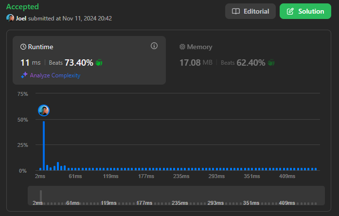

# Entrega Grafos 1 - Problemas do LeetCode

## Questões resolvidas

- [329. Longest Increasing Path in a Matrix](https://leetcode.com/problems/longest-increasing-path-in-a-matrix/description/)

- [787. Cheapest Flights Within K Stops](https://leetcode.com/problems/cheapest-flights-within-k-stops/description/)

- [753. Cracking the Safe](https://leetcode.com/problems/cracking-the-safe/description/)

## Questões extras

- [51. N-Queens](https://leetcode.com/problems/n-queens/description/)

## Vídeo de entrega:

<iframe width="640" height="360" src="https://www.youtube.com/embed/y0unlSQ9qSs" frameborder="0" allow="accelerometer; autoplay; clipboard-write; encrypted-media; gyroscope; picture-in-picture" allowfullscreen></iframe>

